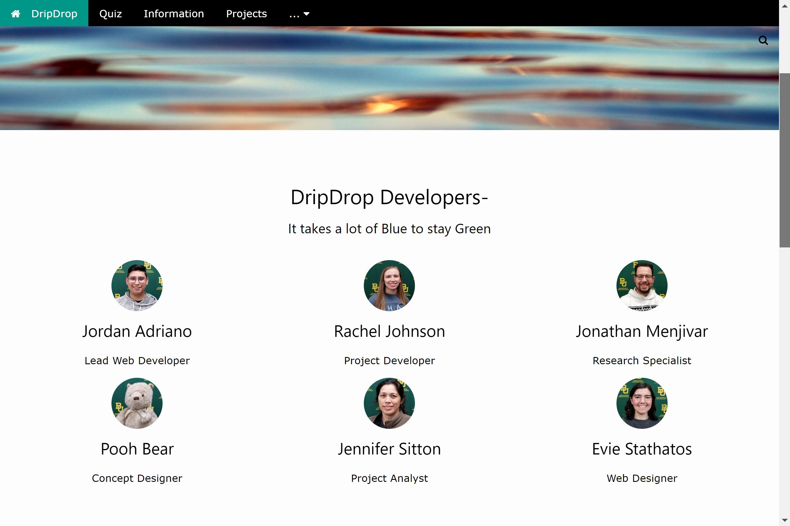

# Drip Drop

DripDrop is a XAMPP based local website that promotes the greater good of water conservation. Through our research of environmental issues, we learned that individuals can make a large impact on their water usage by making small changes in their habits. Our quiz section will give users self-assessments on basic ecological questions. Next, our informational section will inform users about the importance of water irrigation, rainwater harvesting, and vegetation choices. Finally, we created an Arduino irrigation prototype that waters at the most optimal time while harvesting humidity data. Our project can be found in the DIY Projects page. 

